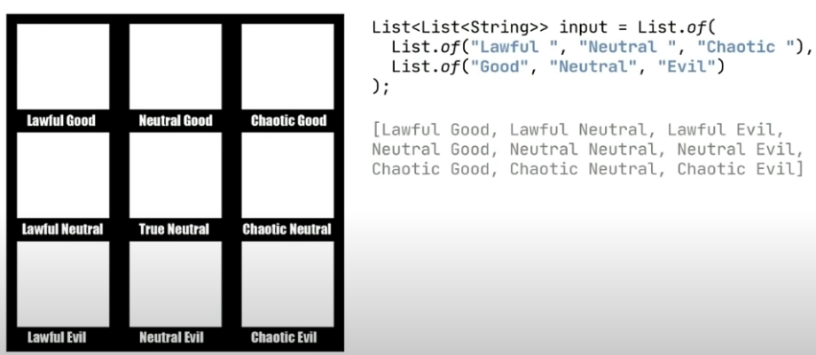
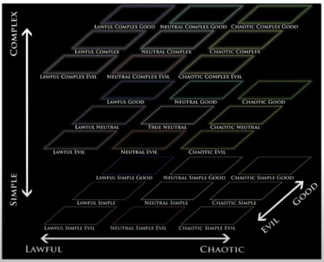
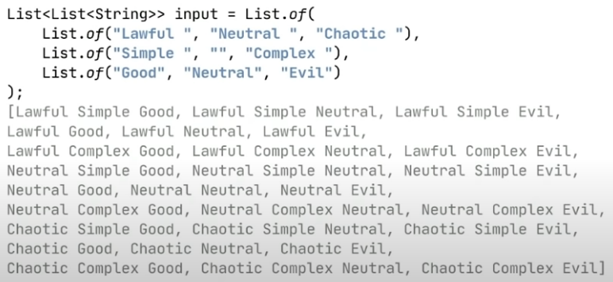

# StreamsAPI
Play with Java streams
[Inspiration](https://www.youtube.com/watch?v=nklbYYQpQi8&pp=wgIECgIIAQ==)

## Sources
* Problem 1: Make the source of child nodes for a given XML DOM node
    * XmlChildNodes
* Problem 2: Make the source of list elements, along with indices
    * IndexedValue
* Problem 3: Zip two list together. Ex:
```java
List.of("JDK 1.0", "J2SE 1.2")
List.of(1996, 1998)

// Zipped to:
"JDK 1.0 was released in 1996"
"J2SE 1.2 was released in 1998"

// signature could be
zip(list1, list2, Pair::new)
    .map(pair -> pair.first() + " was released in " + pair.second())
    . forEach(System.out::println);
```
* Problem 4: Make the cartesian product of lists of strings
* [Cartesian product explanation](http://web.mnstate.edu/peil/MDEV102/U1/S7/Cartesian4.htm#:~:text=Cartesian%20Product%3A%20The%20Cartesian%20product,4%2C%205%2C%206%7D.)

* With additional dimension




d